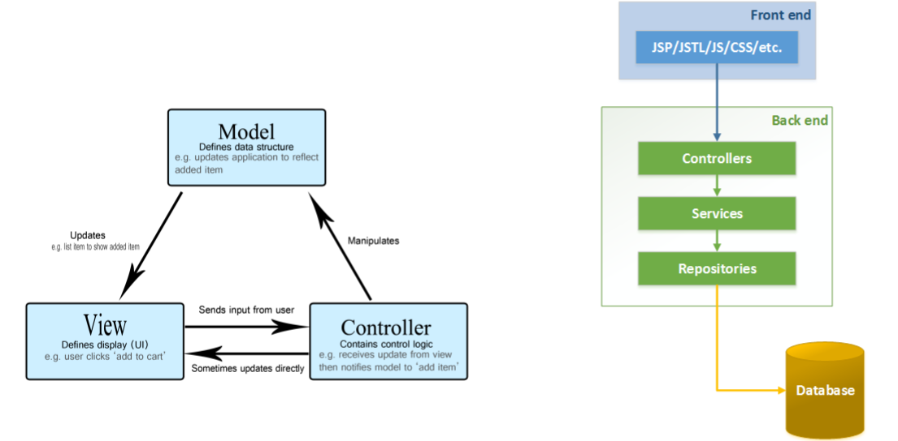
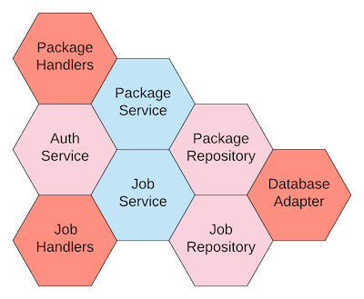

# Hexagonal Architecture by Example (in TypeScript)

by Adam Fanello, Lead Software Architect - Onica by Rackspace Technology © 2020-2022

## Overview

Hexagonal architecture is a pattern of software architecture involving abstracting away all input
and output functionality to keep just your business logic at the core.
It's an extension of the adapter and dependency injection patterns, and used to abstract away
environment specific dependencies to leave your business logic free of such distractions.

## About Application Architectures

When we write software, there are multiple areas of concern to deal with:

1. The runtime environment (Spring, Express.js, AWS Lambda, Kubernetes…)
2. Interfaces to external components (Database, web services, …)
3. Domain specific data persistence (user details, data lake, telemetry data…)
4. Application logic.

The quick hack approach is to glob all of this together.

We'll demonstrate this, and later an improved version, with an example AWS Lambda function.
This function is an API endpoint to create a new "package". This "package" is enhanced with
some metadata and stored in DynamoDB. Sounds simple?
Here's the hacker's implementation: [smushed.ts](src/bad/smushed.ts)
It's straight forward, brief, and all four concerns are smushed together. What's the problem?

### Testability and Fragility

In the smushed implementation, a unit test must deal with the runtime's event structure, database interfacing, and application logic all in one test. 
Further, every handler is going to have to including runtime environment specifics. 
Every test that deals with the database has to deal with the specific database behavior, 
including all the permutations of the various ways it can fail. 
Code like this is why people skip unit testing entirely. Ironically this is the most fragile code and thus in need of testing the most.

Why is this style fragile? Take a look at the database handling. Is robust database interfacing code ever that simple? 
Is this leaking connections? Where is the retry logic? This implementation is happy-path coding, and fragile. 
If you have to deal with all the details of robust database handling in every handler, 
then it quickly overwhelms all other concerns hiding what you are actually trying to accomplish.
As problems pop up, the maintainer will enhance the error handling in the one place where the problem was found
while other areas continue to have the same bugs.

### Coupled vs Decoupled

Sounds all like a basic violation of the Don't Repeat Yourself (DRY) principal, doesn't it?
Indeed DRY is at the heart of hexagonal architecture. 
Hexagonal isn't the only software architecture that deals with DRY; variations of layered architectures also deal with DRY.
Whether it's the frontend Model-View-Controller (MVC) and variants, or the backend layers of Controller-Service-Repository,
layering is a way of splitting concerns. 
From these layering approaches, people often have a preference of coding "top down", or "bottom up". 
The idea here is a *linear* approach with what matters most, your application logic, somewhere in the middle of the flow.

Whether you are coding top-down or bottom-up, 
you are starting your focus on dealing with your environment specific concerns and not at the core of what your application is.
Additionally, while layering helps to separate the concerns it leaves them _highly coupled_.

## A Better Approach

With hexagonal architecture, your application isn't in the middle of a highly coupled flow, but rather the central focus.
That is where you begin, because it is what is important. 
Your application logic need not concern itself with whether it is called from a serverless function or a monolithic container. 
Nor is the application logic concerned whether user data comes from a user pool, relational database, NoSQL database, or web service. 

Your business logic does need to *interface* with the outside environment though, and it does this through
[adapters](https://en.wikipedia.org/wiki/Adapter_pattern).
Most high-level languages have interfaces, and that's what we're talking about here. 
Implementations of these interfaces are the adapters. So you have an interface to a "Package", 
and an implementation that deals with where ever that package data is actually stored. 
Change your mind on where to store the data? Change the adapter, *not* the application logic.

The choice of word "hexagonal" is misleading, as it implies something special about the six sides of a hexagon.
The hexagon shape visually highlights the difference from layer architecture - it isn't just in one end and out the other.
Your application logic is in the _center_ of the shape, and each side is an interface or a category of interfaces. 
You will have as many interfaces (or sides) as you need. 

Sometimes this is alternatively called Ports & Adapters, where “ports” is another name for an interface.
Ports & Adapters was introduced by Alistair Cockburn on his blog in 2005 with the stated goal:

    Allow an application to equally be driven by users, programs, automated test or batch scripts,
    and to be developed and tested in isolation from its eventual run-time devices and databases.
    
### Benefits of Hexagonal Architecture

#### Code is now DRY and robust. 

Need to interface with data? Implement and test that implementation one time,
with all the error control and retry logic needed to make it robust.

#### Application logic is concise. 

You deal with the business requirements, without environment details getting in the way. 
Test the logic, without all the permutations of external factors because they have already been tested. 
Because external interfaces have a limited API, their mocks are easily reused between tests.

#### Application logic is portable.

Want to write your applications as AWS cloud native? 
All the details of Lambdas, DynamoDB, and Cognito are outside of your application logic. 
Write new adapters and you are now running in Google Cloud's Kubernetes, Firebase, etc.. 
You never know what the future may bring.

#### Cleaner, more testable code.

Even if you know for certain that your application will never run in another environment, 
architect your application to be portable anyway because the effort results in cleaner testable code. 

## No More Smush

Here's that [smushed](src/bad/smushed.ts) example rewritten with hexagonal architecture:

- [package.service.ts](src/good/services/package.service.ts) is the application logic - the center of the architecture!
- [package.repository.ts](src/good/repositories/package.repository.ts) handles data storage. This implementation uses DynamoDB.
- [package.lambda.ts](src/good/handlers/package.lambda.ts) deals with adapting from AWS API Gateway and AWS Lambda as the entry point.
- [auth.service.ts](src/good/services/auth.service.ts) generically deals with user authentication.
- [models](src/good/models/index.ts) data is defined in terms that avoid implementation specifics.

The new version has far more files and lines of code. If this were the only endpoint for the entire application,
it would be overkill. The benefits of good software architecture start appearing with the second entry point,
as the adapters are reused.

This new version also employs a few of other good programming practices...

### Unit Tests

Each module in the new example has unit tests with full coverage:
[package.service.spec.ts](src/good/services/package.service.spec.ts), 
[package.repository.spec.ts](src/good/repositories/package.repository.spec.ts), 
[package.lambda.spec.ts](src/good/handlers/package.lambda.spec.ts),
[auth.service.spec.ts](src/good/services/auth.service.spec.ts)

### Dependency Injection

The primary tool for decoupling with interfaces and adapters is a pattern called Dependency Injection (DI).
In the example, we use the [Sailplane project's Injector](https://docs.onica.com/projects/sailplane/en/latest/injector.html). 

New to dependency injection? There is a *lot* of material written about this common pattern already.
Three starting points:

- [A quick intro to DI](https://www.freecodecamp.org/news/a-quick-intro-to-dependency-injection-what-it-is-and-when-to-use-it-7578c84fa88f/) at freeCodeCamp
- [Definition and many examples](https://en.wikipedia.org/wiki/Dependency_injection) on Wikipedia
- [Detailed article](https://www.martinfowler.com/articles/injection.html) from software development legend, Martin Fowler
 
### No Magic Numbers

"Magic" in code is the use of constant values in code that have meaning, but fail to convey that meaning.

The hacker who wrote [smushed.ts](src/bad/smushed.ts) used magic numbers for HTTP status and time calculations. 
For instance, the current time is divided by `1000` and `ttl` is set to that plus `60`.
Why? What does do `1000` and `60` represent? You can figure it out with some thought and experience,
but it'd be clearer if explicit.
In the improved example, we use explicit constants, functions, and types to replace the magic.

### Directory Structure

There are many good choices for organizing your source; all in one directory is not one of them!
The new version [shows a common way of organizing source](src/good) by where it is in the architecture.

## To Interface, or Not To Interface?

Notice that the example didn't define explicit Typescript `interface` types for the adapters.
Writing interfaces to only have one implementation violates the DRY principle. 
I'm reminded of the C/C++ days, when every function was declaration twice: once for the implementation and once in the header.

Separate out the interface from the adapter *on demand*.
Initially you'll only have one implementation of your interface, so there's no need. 
Depending on the language features and unit test framework, that on demand need could happen right away. 
For strongly typed languages like C# and Java, if your test framework doesn't have an ability to mock based on a concrete class, 
then you'll need an interface in order to make your test mocks. So be it; write explicit interfaces. 
For loosely typed languages though, a mock can be created simply by matching the "shape" of your implementation 
and thus an explicit interface isn't needed. If a second adapter is developed, 
that's when the on-demand need comes into play to ensure that the implementations maintain the same API.

## Bigger Alternative Visualization

This visualization is not the normal way to show hexagonal architecture and, pictorially, it won’t scale.
However, I find it is an interesting alternative way of visualizing the relationships between components.

- Besides "packages", we have now added "jobs" to our application.
- Renamed lambdas to more generic "handler", switching to the interface name instead of adapter name.
- Job logic needs to deal with packages too. It may do so via the package service or directly to the package repository - whichever makes sense for your design.
- In any case, the edges of the blue hexagons, your business logic, all exchange information via the domain data models.
- Environmental details exist within and between the red and pink hexagons.

## Learn More

There is much written about Hexagonal Architecture, from other perspectives. Here are a few good reads:

- [Hexagonal Architecture: What Is It and How Does It Work?](https://blog.ndepend.com/hexagonal-architecture/) -
  with examples in C#
- [Ready for changes with Hexagonal Architecture](https://netflixtechblog.com/ready-for-changes-with-hexagonal-architecture-b315ec967749) -
  Netflix's journey from monolith
- [ARC302 Evolutionary AWS Lambda functions with hexagonal architecture](https://www.youtube.com/watch?v=uR4-zuMXElM) -
  from AWS re:Invent 2021
- [Developing evolutionary architecture with AWS Lambda](https://aws.amazon.com/blogs/compute/developing-evolutionary-architecture-with-aws-lambda/) -
  Another example in Lambda with JavaScript
